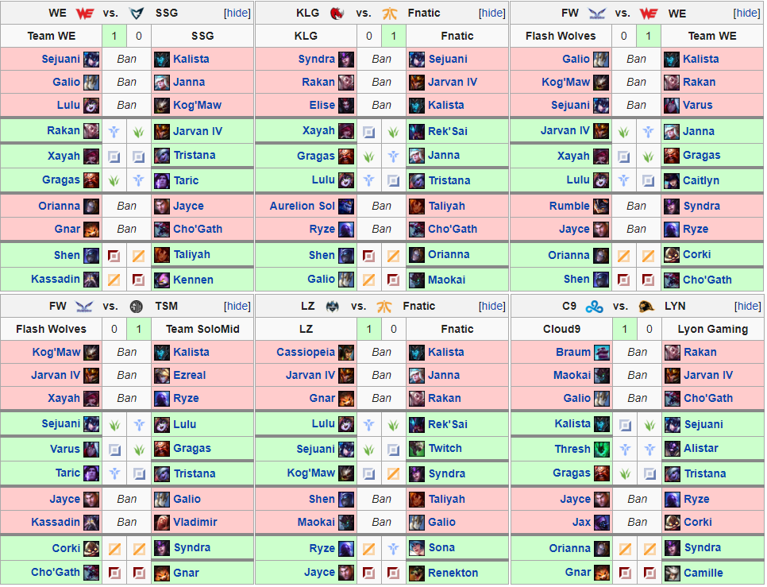
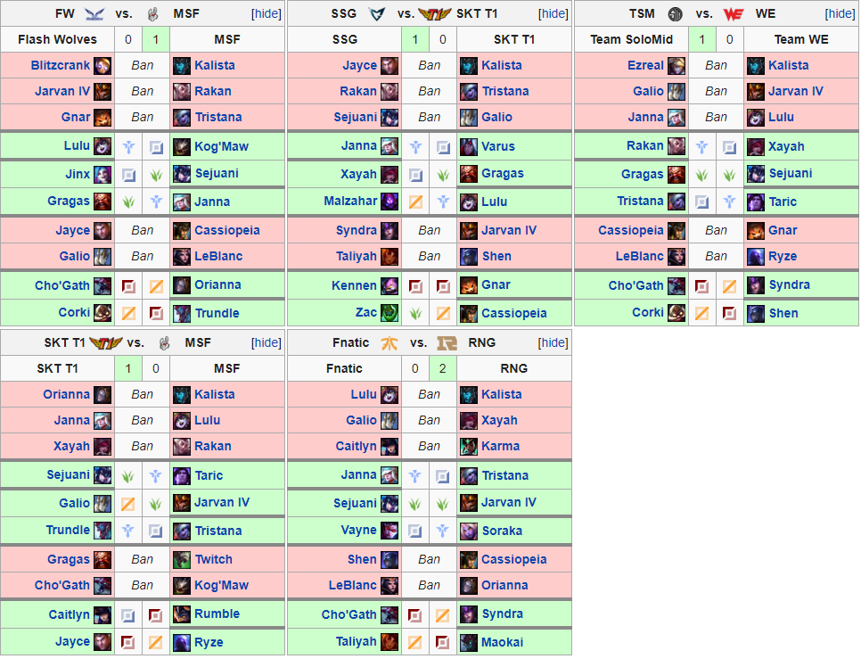

# Swain Bot
Created by Devin Light

A [web version of Swain Bot](https://swainbot.herokuapp.com) (hosted on Heroku) is available to play with. (Note: this model has a limited number of concurrent users and is much slower than the local version because it is hosted using the free tier offered by Heroku)
## Introduction
### What is League of Legends?
League of Legends (abbreviated as LoL, or League) is a multiplayer online battle arena (MOBA) game developed by Riot Games which features two teams of five players each competing in head-to-head matches with the ultimate goal of destroying the opposing team's nexus structure. The game boasts millions of monthly players and a large competitive scene involving dozens of teams participating in both national and international tournaments. The game takes place across two broadly defined phases. In the first phase (or Drafting phase), each side takes turns assembling their team by selecting a unique character (called a champion) from a pool of 138 (as of this writing) without replacement. Then, in the second phase (or Game phase), each player in the match takes control of one of the champions chosen by their team and attempts to claim victory. Although not strictly required by the game, over the years players have grown to play their champion in one of five roles named after the location on the map in which they typically start the game, and often corresponding to the amount of in-game resources that player will have devoted to them. The five roles are:

- Position 1 (primary farm)-> ADC/Marksman<sup>1</sup>
- Position 2 (secondary farm)-> Middle
- Position 3 (tertiary farm)-> Top
- Position 4 (farming support)-> Jungle
- Position 5 (primary support)-> Support<sup>1</sup>

<sup>1</sup> Traditionally the ADC and Support begin the game together same lane and are collectively called 'Bottom'.

Each champion has distinct set of characteristics and abilities that allows them excel in certain situations while struggling in others. In order to maximize the odds of victory, it is important that the team assembled during the drafting phase simultaneously plays into one cohesive set of strengths and disrupts or plays well against the strengths of the opposing draft. There are two types of submissions made during the drafting phase. In the banning portions of the draft champions are removed from the pool of allowed submissions, whereas champions are added to the roster of the submitting team during the pick phases. The drafting alternates between banning and picking until both teams have a full roster of five champions, at which point the game is played. The structure of the drafting phase is displayed in Figure 1. Note the asymmetry between teams (for example Blue bans first in ban phase one, while Red bans first in ban phase two) and between the phases themselves (ban phases always alternate sides, while pick phases "snake" between teams).


### What is Swain Bot?
Swain Bot (named after the champion Swain who is associated with being a ruthless master tactician/general) is a machine learning application built in Python using Google's Tensorflow framework. Swain Bot is designed to analyze the drafting phase of competitive League of Legends matches. Given a state of the draft which includes full information of our team's submissions (champions and positions) and partial information of the opponent's submissions (champions only), Swain Bot attempts to suggest picks and bans that are well-suited for the current state of our draft.

### What do we hope to do with Swain Bot?
Knowing the best pick for a given draft situation can dramatically improve a team's chance for success. Our objective with Swain Bot is to help provide insight into League's crucial draft phase by attempting to answer questions like:
- Can we estimate how valuable each submission is for a given state of the draft? 
- Is there a common structure or theme to how professional League teams draft? 
- Can we identify the differences between a winning and a losing draft?

## Assumptions and Limitations
Every model tasked with approaching a difficult problem is predicated on some number assumptions which in turn define the boundaries that the model can safely be applied. Swain Bot is no exception, so here we outline and discuss some of the explicit assumptions being made going into the construction of the underlying model Swain Bot uses to make its predictions. Some of the assumptions are more impactful than others and some could be removed in the future to improve Swain Bot's performance, but are in place for now for various reasons.

1. Swain Bot is limited to data from recorded professionally played games from the "Big 5" regions (NALCS, EULCS, LCK, LPL, and LMS). Limiting potential data sources to competitive leagues is very restrictive when compared to the pool of amateur matches played on servers across the world. However, this assumption is in place as a result of changes in Riot's (otherwise exceptional) API which effectively randomizes the order in which the champion submissions for a draft are presented, rendering it impossible to recover the sequence of draft states that make up the complete information regarding the draft. Should the API be changed in the future Swain Bot will be capable of learning from amateur matches as well. 

2. Swain Bot does not receive information about either the patch the game was played on or the teams involved in the match. Not including the patch allows us to stretch the data as much as we can given the restricted pool. Although the effectiveness of a champion might change as they are tuned between patches, it is unlikely that they are changed so much that the situations that the champion would normally be picked in are dramatically different. Nevertheless substantial champion changes have occured in the past, usually in the form of a total redesign. Additionally, although team data for competitive matches is available during the draft, Swain Bot's primary objective is to identify the most effective submissions for a given draft state rather than predict what a specific team might select in that situation.  It would be possible to combine Swain Bot's output with information about a team's drafting tendencies (using ensemble techniques like stacking) to produce a final prediction which both suits the draft and is likely to be chosen by the team. However we will leave this work for later.

3. Swain Bot's objective is to associate the combination of a state and a potential submission with a value and to suggest taking the action which has the highest value. This valuation should be based primarily on what is likely to win the draft (or move us towards a winning state), and partly on what is likely to be done. Although these two goals may be correlated (a champion that is highly-valued might also be the one selected most frequently) they are not necessarily the same since, for example, teams may be biased towards or against specific strategies or champions.

4. Swain Bot's objective to estimate the value of submissions for a given draft state is commonly approached using techniques from Reinforcement Learning (RL). RL methods have been successfully used in a variety of situations such as teaching robots how to move, playing ATARI games, and even [playing DOTA2](https://blog.openai.com/dota-2/). A common element to most RL applications is the ability to automatically explore and evaluate states as they are encountered in a simulated environment. However, Swain Bot is not capable of automatically playing out the drafts it recommends in order to evaluate them (yet..) and so is dependent on the data it observes originating from games that were previously played. This scenario is reminiscent of a Supervised Learning (SL) problem called behavioral cloning, where the task is to learn and replicate the policy outlined by an expert. However, behavioral cloning does not include the estimation of values associated with actions and attempts to directly mimic the expert policy. Swain Bot instead implements an RL algorithm to estimate action values (Q-Learning), but trained using expertly-generated data. In practice this means that the predictions made by Swain Bot can only have an expectation of accuracy when following trajectories that are similar to the paths prescribed by the training data.

## Methods
This section is not designed to be too technical, but rather give some insight into how Swain Bot is implemented and some important modifications that helped with the learning process. For some excellent and thorough discussions on RL, check out the following:
- [David Silver's course on RL](http://www0.cs.ucl.ac.uk/staff/d.silver/web/Teaching.html) [(with video lectures)](https://www.youtube.com/watch?v=2pWv7GOvuf0)
- [Reinforcement Learning](http://incompleteideas.net/book/the-book-2nd.html) By Sutton and Barto
- [The DeepMind ATARI paper](https://storage.googleapis.com/deepmind-media/dqn/DQNNaturePaper.pdf)
- [Dueling DQNs](https://arxiv.org/pdf/1511.06581.pdf)
- And finally a [few](http://outlace.com/rlpart3.html), [useful](https://www.intelnervana.com/demystifying-deep-reinforcement-learning/), [tutorials](https://medium.com/emergent-future/simple-reinforcement-learning-with-tensorflow-part-0-q-learning-with-tables-and-neural-networks-d195264329d0)

### Representing Draft States and Actions
Each of the _N_ eligible champions (138 as of this writing) in a draft is represented by a unique `champion_id` integer and every position in the game (five positions per team plus banned champions) is given by a `position_id`. An _action_ (or _submission_) to the draft is defined as tuple of the form `(champion_id, position_id) = (i,j)` representing the selection of champion `i` to position `j` in the draft. We can represent the _draft state_ as a boolean matrix _S_ where _S_(i,j) = 1 if the ith champion is present in the draft at the jth position. The number of columns in _S_ is determined by how much information about the positions is available to the drafter:
- In a _completely informed_ draft all position information is known so _S_ is an `N x 11` matrix (10 positions + bans).
- In a _partially informed_ draft position information is only known for the drafter's team whereas only the `champion_id`s are known for the opponent's team. As a result _S_ is given by an `N x 7` matrix (5 positions + bans + enemy champion ids).

Note that the _S_ is a sparse matrix since for any given state of a draft, there are no more than 10 picks and 10 bans that have been submitted so there are no more than 20 non-zero entries in _S_ at any given time. Swain Bot operates using partially informed draft states as inputs which may be obtained by projecting the five columns in the completely informed state corresponding to the positions in the opponent's draft onto a single column. Finally, we define the _actionable state_ to be the submatrix of _S_ corresponding to the actions the drafter may submit-- that is the columns corresponding to bans as well as the drafter's five submittable positions. 

### Drafting as a Markov Decision Process (MDP)
An individual experience (sometimes called a memory) observed during the draft can be recorded as a tuple of the form `e_k = (s_k,a_k,r_k,s')` where `s_k` is the initial state of the draft before an action was taken, `a_k` is the action submitted, `r_k` is the reward observed as a result of taking `a_k`, and `s'` is the successor state transitioned to away from `s_k`. For either completely or partially informed states, the draft can be fully recovered using the sequence of experiences `(e_0, e_1,..., e_n)` transitioned through during the draft. This sequence defines a Markov chain because given the current state _s_, the value of the successor state _s'_ is independent of the states that were transitioned through before _s_. In other words, the possible states we are able to transition to away from _s_ depend only on _s_ itself, and not on the states that were seen on the way to _s_. 

To complete the description of drafting as an MDP we need to define a reward schedule and discount factor. The discount factor is a scalar value between 0 and 1 that governs the present value of future expected rewards. Two common reasons to use a discount factor are to express uncertainty about the potential value of the future and to capture the extra value of taking an immediate reward over a delayed one (e.g. if the reward is financial, an immediate reward is worth more than a delayed reward because that immediate reward can then be used to earn additional interest). Typical discount factor values are in the range `0.9` to `0.99`. Swain Bot uses `discount_factor = 0.9`.

The reward schedule is a vital component of the MDP and determines what policy the model will ultimately converge towards. As previously discussed, Swain Bot's long-term objective is to select actions which move the draft towards a winning state while in the short term placing some value on actions which are likely to be taken. The ideal reward schedule should combine these two goals so that Swain Bot predicts both good and probable actions. We will approach this by associating larger magnitude rewards with _terminal_ states and smaller magnitude rewards with non-terminal states. A terminal state _s_ occurs in one of the three scenarios where _s_ represents:
1. a valid, complete draft which resulted in a win
2. a valid, complete draft which resulted in a loss
3. an invalid draft (which cannot be played)

All other states are valid, but non-terminal. An invalid state _s_ is one in which one or more of the following conditions are satisfied where _s_ represents:
1. an incorrect number of picks or bans for the phase of the draft described by that state (e.g. any number of picks submitted during Ban Phase 1, four picks submitted by blue side during Pick Phase 1, two consecutive picks associated with red side during Pick Phase 2, etc.)
2. at least one champion selected in more than one position (e.g. picked and banned, picked by both teams, or picked by a team in more than one role)
3. at least one non-ban actionable position with more than one champion submitted in that position. For partially complete drafts the opposing team position must also have no more than five submissions represented at any given time.

The empirically determined reward schedule is defined in two parts depending on if _s_ is a terminal state. If _s_ is terminal, the reward is given by


If _s_ is non-terminal, the reward has the more simple form


where _a_* is the action taken during the original memory.

### Deep Q-Learning (DQN)
With the framework describing drafting as an MDP, we can apply a Q-Learning algorithm to estimate `Q(s,a)`, the maximum expected future return by taking action `a` from state `s`. With 138 total champions and 20 chosen at a time to appear in the final draft state, there are roughly `6.07x10^{23}` possible ending states, making a tabular Q-learning method out of the question. Instead, we opt to use a straightforward fully connected neural network to estimate the value function for an arbitrary state. For a great (and freely available) introduction to CNNs, see Stanford's [CS231n](http://cs231n.stanford.edu/). The selected model's architecture consists of 4 total layers:
- 1 One-hot encoded input layer (representing draft state)
- 2 FC + ReLU layers with `1024` nodes each
- 1 FC linearly activated output layer with `n_champ x n_pos+1` nodes (representing actions from the actionable state)

Regularization is present in the model via dropout in between the FC layers. In order to help reduce the amount of time the model spends learning the underlying draft structure, the first FC layer is given several supplementary boolean inputs corresponding to which positions have been filled in the draft as well as if the draft is currently in a banning phase. These inputs aren't strictly necessary since the value of these variables is directly inferrable from the state matrix, but doing so substantially reduces the amount of training time required before the model begins producing legal submissions for input states. There are also three important modifications to the fundamental DQN algorithm that are necessary in order to ensure that the Q-learning is stable:
1. Data augmentation
2. Experience Replay (ER)
3. Double DQN (DDQN)

Data augmentation refers to modifying existing training data in order to effectively increase the size of the training set and help reduce model overfitting. The techniques used to modify the data include adding random noise to training data or cropping, mirroring, and rotating images. For the purposes of data augmentation in Swain Bot, we identify two types of augmentable submissions: sequential picks and bans. Referring to the original image of the drafting structure, notice that several of the submissions made during the two pick phases are made sequentially: red side's first two picks, blue side's second and third picks, and blue side's fourth and fifth picks. Swain Bot makes predictions one action at a time, so the order in which these submissions are presented is preserved and the input state for the second submission will include the first submission as a result. However, since these submissions are made back-to-back, in practice sequential picks use the same initial state and the order in which they are presented is arbitrary. A simple augmentation which helps Swain Bot emulate this common initial state is to randomly exchange the order in which sequential picks in the draft are executed. For example, if a sample draft includes two memories corresponding to red side sequentially picking (Kalista, ADC) and then (Leona, Support), half of the time the order in which these picks are learned from would be reversed. 

The second augmented submissions are bans that share a common phase. Technically the drafting structure alternates between teams during bans, meaning that the initial state for each ban is distinct and as a result the order in which they are submitted is important. On the other hand, the purpose behind banning is to either protect your draft (by removing strong submissions against your team) or attack the enemy draft (by removing strong submissions to their team). In either circumstance, the bans we submit do not depend on the opponent's submissions _except in the case where they ban a champion which we would otherwise ban_. Unlike picks, however, our opponents "sniping" a ban actually _benefits_ our draft by effectively allowing our team to make an additional ban. This effect can be approximated by randomly shuffling the order in which the bans of a given phase are presented, just like we did with sequential picks. Note that bans cannot be shuffled across phases because bans made during the second phase are made with information about 3/5ths of the picks for each team available.

Experience replay provides a mechanism for separating the generation of memories from learning from those memories. In experience replay, each experience associated with a draft is stored into a pool of experiences spanning many drafts. The Q-learning update is applied to a minibatch of randomly sampled experiences contained within the pool. This is important because consecutive experiences generated from the same draft are strongly correlated and learning from them all simultaneously using SGD is not only inefficient, but may also lead to a local (suboptimal) minimum. By randomizing the samples drawn from the replay buffer, the correlation between experiences is at least broken. Additionally, each memory is potentially used in multiple updates, improving overall data efficiency. 

The default DQN algorithm selects actions "greedily" by taking the maximum over the estimated action-values. A side effect of this maximization is that the DQN tends to learn overestimated values. Unfortunately this over optimism is often non-uniformly distributed across actions and can degrade the performance of the learned policy. Furthermore, this overestimation also tends to grow as the number of actions increases. There are 822 (137 champions each selectable in 6 positions) possible actions during each stage of drafting. As a result, it is desirable to control this overestimation as much as possible. The DDQN algorithm proposed by van Hesselt et. al. attempts to limit this overestimation by pseudo-decoupling action selection from evaluation by utilizing two networks: an "online" network and a "target" network. The online network represents the most up-to-date parameter estimates, while the target network is a periodic snapshot of the online network. In simplest terms the original update for DQN

`update = reward + discount_factor*max_a'{Q(s',a')}`

is replaced with 

`update = reward + discount_factor*Q_target(s', max_a'{Q_online(s',a')})`.

Note that this doesn't truly decouple action selection and evaluation because the target network is a copy of a previous online network. The goal of DDQN is to be the simplest modification of DQN in the direction of a truly decopuled algorithm (like double Q-learning) in order to get most of the benefit with the smallest computational overhead required.

## Analysis
### Evaluating the Model
In addition to the "eyeball test" of Swain Bot's predictions (i.e. no illegal submissions, correct number of roles, overall "meta-feel" of drafts, etc.), we're also interested in a quantitative measure of performance. 

One approach is to treat predictions as we would with a classifier and measure the fraction of predictions which agree with what was actually submitted in a winning draft. However, it's important to recall that our objective is to predict valuable submissions which may not necessarily overlap with what a specific team is likely to submit. It is often the case that multiple submissions are suited for the draft and as a result each have roughly equal value (this is particularly true for bans and early submissions). Selecting an action from amongst these valid picks is mostly a function of the biases of the drafting team. Since team identities aren't included as part of the input, it is unrealistic to expect the model to match the exact submission made by every team. A simple way to try and compensate for this is to group the top `k` submissions and regard these as a set of "good" picks according to the model. Then we measure accuracy as the fraction of submissions made that are contained in the predicted "good" submission pool for each state. 

Another approach is to examine the difference in estimated Q-values between the top prediction (`max_a{Q(s,a)}`) and the actual submission (`Q(s,a*)`). The difference between these two values estimates how far off the actual action that was submitted is from taking over as the top prediction. If both the top recommendation and `a*` are really a good submissions for this state this difference should be relatively small. If we use this to compute a normalized mean squared error over a each state we are predicting for we should get an estimate of the model performance:


Note that if the model were to assign all actions the same value then this measure of error would be trivially zero. So just like the classification measure of accuracy, this measure of error is not perfect. Nevertheless the combination gives some insight into how the model performs.

### Training Data
Competitive match data was pulled from [lol.gamepedia.com](https://lol.gamepedia.com).

The model was trained in two stages. For the first stage, data was obtained from matches played during the 2017 Summer Season and 2017 Worlds Championship Qualifiers for the five major international regions:
- North America (NA LCS)
- Europe (EU LCS)
- China (LPL)
- Korea (LCK)
- Taiwan, Hong Kong, & Macau (LMS)

Between the two training stages the model underwent a dampening iteration (in which the value of all predictions were reduced) in order to simulate a change in metas associated with the gap in time between the Summer Season and Worlds Championships. The second stage of training used data from the 119 matches played during the 2017 World Championship with 11 randomly selected matches from the knockout stages held out for validation. The model learned on each match in the training set for 100 epochs (i.e. each match was seen 100 times in expectation). The model was trained using a smaller learning rate `alpha_0 = 1.0e-05` which was halved every 10 epochs until it reached a minimum value of `alpha_f = 1.0e-08`. 

### Validation Matches
The figures below illustrates the drafts from each match in the validation set. The left side of the draft represents the submissions made by the blue side, while the right side depicts submissions made by the red side. 




The distribution of the eleven matches according to the stage of the worlds event they were played in was:
- Play-in stage: 2 matches
- Group stage: 5 matches
- Knockout stage: 3 matches
- Finals: 1 match

The table below lists the classification (top 1), "good" set classification (top 5), and normalized root mean square error (l2 error) for three categories: all submissions predicted (full), all submissions excluding the first phase of bans (no round 1 bans), and picks only (no bans).

```
Norm Information:
 Full
  Num_predictions = 110
  top 1: count 19 -> acc: 0.1727
  top 5: count 62 -> acc: 0.5636
  l2 error: 0.02775
---
 No Round 1 Bans
  Num_predictions = 77
  top 1: count 17 -> acc: 0.2208
  top 5: count 47 -> acc: 0.6104
  l2 error: 0.03004
---
 No Bans
  Num_predictions = 55
  top 1: count 14 -> acc: 0.2545
  top 5: count 39 -> acc: 0.7091
  l2 error: 0.02436
```

Starting with the top 1 classification accuracy it's apparent that predicting the exact submission at every stage in the draft is difficult for the model, which achieves an abysmal 15-25% accuracy across the three categories. This is likely due to a combination of lacking information about which teams are drafting (which would allow the model to distinguish between submissions that are either "comfort picks" or picks that a team is biased against) and the weighting difference between winning submissions and likely submissions. For the top 5 classification accuracy the model improves significantly, particularly when the first three bans are ignored. The stable l2 error also indicates that the model at least associates elevated values for the submissions from winning drafts even if they are not the exact submission it predicts. Finally, the jump in performance between the full set of predictions and the predictions excluding the first phase of banning generally holds true. In contrast, the difference in performance after further removing the second phase of bans is smaller. This suggests that earlier submissions in the draft are significantly more difficult to predict than later ones. This might be due to a combination of factors. First, since the submissions are the furthest away from the most rewarding states there is a large uncertainty in associating the reward observed at the end of a draft with the first few selections submitted. Second, even after it's complete the first phase of bans contributes relatively little information to the draft when compared with the information gained after several picks have been made. Finally, the first phase ban submissions are perhaps the most significantly influenced by team biases since they tend to revolve around removing the picks you and your opponent are likely to make.

For completeness here is the table for all 2017 Worlds matches (including the play-in stages): 
```
Norm Information:
 Full
  Num_predictions = 1190
  top 1: count 549 -> acc: 0.4613
  top 5: count 905 -> acc: 0.7605
  l2 error: 0.01443
---
 No Round 1 Bans
  Num_predictions = 833
  top 1: count 513 -> acc: 0.6158
  top 5: count 744 -> acc: 0.8932
  l2 error: 0.01136
---
 No Bans
  Num_predictions = 595
  top 1: count 371 -> acc: 0.6235
  top 5: count 525 -> acc: 0.8824
  l2 error: 0.01049
```
Obviously since the model was trained on the majority of these matches it performs much better.

Worlds 2017 was dominated by the "Ardent Censer" meta which favored hard-scaling position 1 carries combined with position 5 supports who could abuse the item Ardent Censer (an item which amplified the damage output of the position 1 pick). This made using early picks to secure a favorable bot lane matchup extremely popular. The remaining pick from the first phase tended to be spent selecting a safe jungler like Jarvan IV, Sejuani, or Gragas. As a result, if we look at the distribution of positions made during the first phase of each of the 119 drafts conducted at 2017 Worlds we can see a strong bias against the solo lanes (positions 2 and 3). 

```
Phase 1: Actual
  Position 1: Count 111, Ratio 0.311
  Position 2: Count  28, Ratio 0.0784
  Position 3: Count  24, Ratio 0.0672
  Position 4: Count  92, Ratio 0.258
  Position 5: Count 102, Ratio 0.286
```

We can compare this with the positions of the top 5 recommendations made by Swain Bot during the first pick phase:

```
Phase 1 Recommendations:
  Position 1: Count 569, Ratio 0.319
  Position 2: Count 233, Ratio 0.131
  Position 3: Count 250, Ratio 0.14
  Position 4: Count 310, Ratio 0.174
  Position 5: Count 423, Ratio 0.237
```
Swain Bot agrees with the meta in using early picks to secure a bot lane. However, by comparison it is more likely to suggest a solo lane pick in the first phase instead of a jungler. This effect was also seen in the actual drafts towards the end of the tournament where solo lane picks like Galio and Malzahar became increasingly valuable and took over what would have likely been jungler picks in the earlier stages.

## Looking Ahead
Even with the promising results so far, Swain Bot is far from complete. Here are just a few things that could be worth looking into for the future:

- Compared with the massive number of possibilities for drafting, we're still limited to the relatively tiny pool of drafts coming from competitive play. As a result Swain Bot's ability to draft is really limited to the types of picks likely to be seen in the professional leagues (for fun try asking Swain Bot what to pick after adding champions in positions that are rarely/never seen in competitive play like Teemo or Heimerdinger). Ideally we would have access to detailed draft data for the millions of games played across all skill levels through [Riot's API](https://developer.riotgames.com), but unfortunately the API does not preserve submissions in draft order (yet). If we could have one wish this would be it. There is some hope for the future with the recently announced competitive 5v5 [Clash mode](https://nexus.leagueoflegends.com/en-us/2017/12/dev-clash/).

- Build a sequence of models each using a small number of patches or a single patch for data. This could help improve Swain Bot's meta adaptation between patches by ensembling this sequence to make predictions from the most recent "meta history" while data from a new patch is being processed.

- Including some form of team data for competitive drafts, either as a model input or as an additional layer on top of the current model structure. Swain Bot's current iteration implicitly assumes that every team is able to play every champion at the highest level. Even for the best players in the world, this is certainly not true. By adding information about the biases of the teams drafting, we could improve Swain Bot's ability to make suggestions which suit both the meta and the team.

- Exploring alternative models (in particular Actor-Critic Policy Gradient). The DDQN model Swain Bot implements is by no means a poor one, but in the constantly evolving world of machine learning it is no longer cutting-edge. In particular our implementation of DDQN is deterministic, meaning that when presented with the same input state the model will always output the same action. If recommendations made by Swain Bot were to be used in practice to assemble a draft, this could be potentially abused by our opponents. Policy gradient methods parameterize the policy directly and are able to represent both stochastic and deterministic policies. 

- Reducing the required training time using GPUs and/or services like AWS.

## Conclusion
Thank you for taking the time to read through this write up. Working on Swain Bot was originallly an excuse to dive into machine learning but eventually became a huge motivator to keep learning and grinding.. especially early on when nothing was stable. I also want to give a huge thank you to Crystal for supporting me in my now year-long diversion into machine learning and both being someone to lean on through the hard times and someone to celebrate with during the good times. I couldn't have done this without you. Thank you also to the greatest group of friends I could ask for. League is a fun game on its own, but I wouldn't still be so excited to play after so many years if it wasn't for you (and your reluctant tolerance for Nunu Top). Finally, thank you to the folks at Riot Games. The passion, excitement, and devotion you show for your product is infectious.


## Disclaimer
Swain Bot isn’t endorsed by Riot Games and doesn’t reflect the views or opinions of Riot Games or anyone officially involved in producing or managing League of Legends. League of Legends and Riot Games are trademarks or registered trademarks of Riot Games, Inc. League of Legends © Riot Games, Inc.
