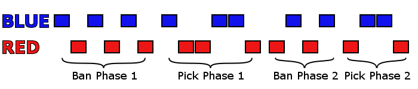
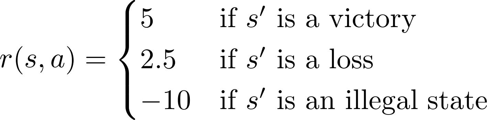
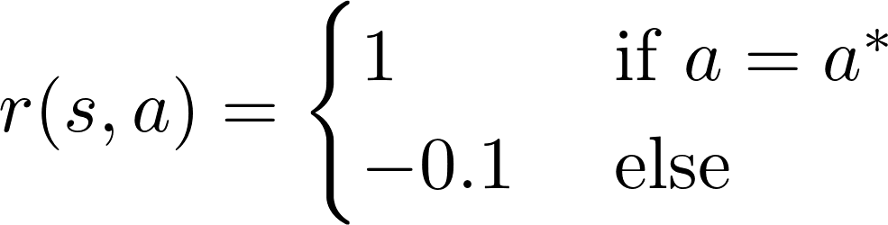
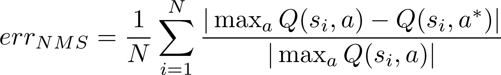
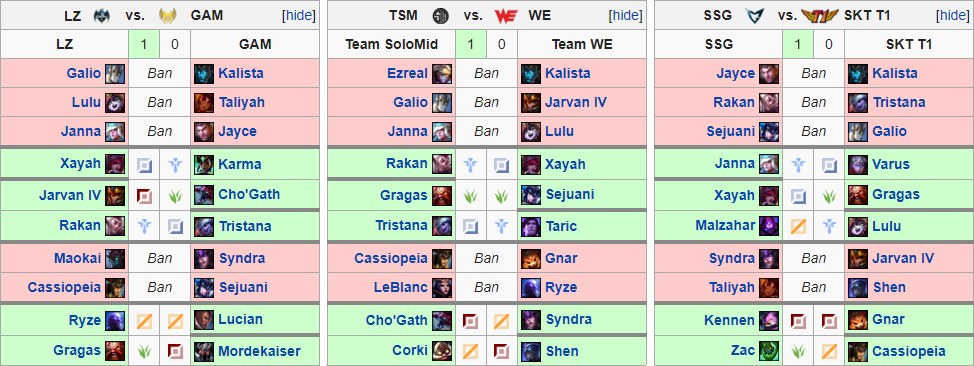

# Swain Bot
Created by Devin Light
A [web version of Swain Bot](swainbot.herokuapp.com) (hosted on Heroku) is available to play with. (Note: this model has a limited number of concurrent users and is much slower than the local version because it is hosted using the free tier offered by Heroku)
## Introduction
### What is League of Legends?
League of Legends (abbreviated as LoL, or League) is a multiplayer online battle arena (MOBA) game developed by Riot Games which features two teams of five players each competing in head-to-head matches with the ultimate goal of destroying the opposing teams nexus structure. The game boasts millions of monthly players and a large competitive scene involving dozens of teams participating in both national and international tournaments. The game takes place across two broadly defined phases. In the first phase (or Drafting phase), each side takes turns assembling their team by selecting a unique character (called a champion) from a pool of almost 140 (as of this writing) without replacement. Then, in the second phase (or Play phase), each player in the match takes control of one of the champions chosen by their team and attempts to claim victory. Although not strictly required by the game, over the years players usually elect to play their champion in one of five roles named after the location on the map in which they typically start the game, and often corresponding to the amount of resources that player will have devoted to them:

- Position 1 (primary farm)-> ADC/Marksman1
- Position 2 (secondary farm)-> Middle
- Position 3 (tertiary farm)-> Top
- Position 4 (farming support)-> Jungle
- Position 5 (primary support)-> Support1

1 Typically the ADC and Support begin the game together same lane and are collectively called 'Bottom'.

Each champion has distinct set of characteristics and abilities that allows them excel in certain situations while struggling in others. In order to maximize the odds of victory, it is important that the team assembled during the drafting phase simultaneously plays into one cohesive set of strengths and disrupts or plays well against the strengths of the opposing draft. There are two types of submissions made during the drafting phase. In the banning portions of the drafting phase champions are removed from the pool of allowed submissions, whereas champions are added to the roster of the submitting team during the pick phases. The draft phase alternates between banning and picking until both teams have a full roster of five champions, at which point the game is played. The structure of the drafting phase is displayed in Figure 1. Note the asymmetry between teams (for example Blue bans first in ban phase one, while Red bans first in ban phase two) and between the phases themselves (ban phases always alternate sides, while pick phases "snake" between teams).

### What is Swain Bot?
Swain Bot (named after the champion Swain whose moniker is "The Master Tactician") is a machine learning application built in Python and using Google's Tensorflow framework. Swain Bot is designed to analyze the drafting phase of competitive League of Legends matches. Given a state of the draft which includes full information of our team's submissions (champions and positions) and partial information of the opponent's submissions (champions only), Swain Bot attemps to suggest picks and bans that are well-suited for our draft.

### What do we hope to do with Swain Bot?
Our objective with Swain Bot is to be able to provide insight into a few questions about League's draft phase:
- Can we estimate how valuable each submission is for a given state of the draft?
- Is there a common structure or theme to how professional League teams draft?
- Can we identify the differences between a winning and a losing draft?

## Assumptions and Limitations
Every model tasked with approaching a difficult problem is predicated on some number assumptions which in turn define the boundaries that the model can safely be applied. Swain Bot is no exception, so here we outline and discuss some of the explicit assumptions being made going into the construction of the underlying model Swain Bot uses to make its predictions. Some of the assumptions are more impactful than others and some could be removed in the future to improve Swain Bot's performance, but are in place for now for various reasons.

1. Swain Bot is limited to data from recorded professionally played games from the "Big 5" regions (NALCS, EULCS, LCK, LPL, and LMS). Limiting potential data sources to competitive leagues is very restrictive when compared to the pool of amature matches played on local servers across the world. However, this assumption is in place as a result of changes in Riot's (otherwise exceptional) API which effectively randomizes the order in which the champion submissions for a draft are presented, rendering it impossible to recover the sequence of draft states that make up the complete information regarding the draft. Should the API be changed in the future Swain Bot will be capable of learning from amature matches as well. 

2. Swain Bot does not recieve information about either the patch the game was played on or the teams involved in the match. Not including the patch allows us to stretch the data as much as we can given the restricted pool. Although the effectiveness of a champion might change as they are tuned between patches, it is unlikely that they are changed so much that the situations that the champion would normally be picked in are dramatically different. Nevertheless substantial champion changes have occured in the past, usually in the form of a total redesign. Additionally, although team data for competitive matches is available during the draft, Swain Bot's primary objective is to identify the most effective submissions for a given draft state rather than predict what a specific team might select in that situation.  Nevertheless it would be possible to combine Swain Bot's output with information about a team's drafting tendencies (using ensemble techniques like stacking) to produce a final prediction which both suits the draft and is likely to be chosen by the team. However we will leave this work for later.

3. Swain Bot's objective is to associate the combination of a state and a potential submission with a value and to suggest taking the action which has the highest value. This valuation should be based primarily on what is likely to win the draft (or move us towards a winning state), and partly on what is likely to be done. 
Although these two goals may be correllated (a champion that is highly-valued might also be the one selected most frequently) they are not necessarily the same since, for example, teams may be biased towards or against specific strategies or champions.

4. Swain Bot's objective to estimate the value of submissions for a given draft state is commonly approached using techniques from Reinforcement Learning (RL). RL methods have been successfully used in a variety of situations such as teaching robots how to move, playing ATARI games, and even [playing DOTA2](https://blog.openai.com/dota-2/). A common element to most RL applications is the ability to automatically explore and evaluate states as they are encountered in a simulated environment. However, Swain Bot is not capable of automatically playing out the drafts in order to evaluate them (yet..) and so is dependent on the data it observes originating from games that were previously played. This scenario is reminiscent of a Supervised Learning (SL) problem called behavioral cloning, where the task is to learn and replicate the policy outlined by an expert. However, behavioral cloning does not include the estimation of values associated with actions and attempts to directly mimic the expert policy. Swain Bot instead implements an RL algorithm to estimate action values (Q-Learning), but trained using expertly-generated data. In practice this means that the predictions made by Swain Bot can only have an expectation of accuracy when following trajectories that are similiar to the paths prescribed by the training data (which we will see later).

## Methods
This section is not designed to be too technical, but rather give some insight into how Swain Bot is implemented and some important modifications that helped with the learning process. For some excellent and thorough discussions on RL, check out the following:
- [David Silver's course on RL](http://www0.cs.ucl.ac.uk/staff/d.silver/web/Teaching.html) [(with video lectures)](https://www.youtube.com/watch?v=2pWv7GOvuf0)
- [Reinforcement Learning](http://incompleteideas.net/sutton/book/the-book.html) By Sutton and Barto
- [The DeepMind ATARI paper](https://storage.googleapis.com/deepmind-media/dqn/DQNNaturePaper.pdf)
- [Dueling DQNs](https://arxiv.org/pdf/1511.06581.pdf)
- And finally a [few](http://outlace.com/rlpart3.html), [useful](https://www.intelnervana.com/demystifying-deep-reinforcement-learning/), [tutorials](https://medium.com/emergent-future/simple-reinforcement-learning-with-tensorflow-part-0-q-learning-with-tables-and-neural-networks-d195264329d0)

### Representing Draft States and Actions
Each of the _N_ eligible champions (138 as of this writing) in a draft is represented by a unique `champion_id` integer and every position in the game (five positions per team plus banned champions) is given by a `position_id`. An _action_ (or _submission_) to the draft is defined as tuple of the form `(champion_id, position_id) = (i,j)` representing the selection of champion `i` to position `j` in the draft. We can represent the _draft state_ as a boolean matrix _S_ where _S_(i,j) = 1 if the ith champion is present in the draft at the jth position. The the number of columns in _S_ is determined by how much information about the positions is available to the drafter:
- In a _completely informed_ draft all position information is known so _S_ is an `N x 11` matrix (10 positions + bans).
- In a _partially informed_ draft position information is only known for the drafter's team whereas only the `champion_id`s are known for the opponent's team. As a result _S_ is given by an `N x 7` matrix (5 positions + bans + enemy champions).

Note that the _S_ is a sparse matrix since for any given state of a draft, there are no more than 10 picks and 10 bans that have been submitted so there are no more than 20 non-zero entries in _S_ at any given time. Swain Bot operates using partially informed draft states as inputs which may be obtained by projecting the five columns in the completely informed state corresponding to the positions in the opponent's draft onto a single column. Finally, we define the _actionable state_ to be the submatrix of _S_ corresponding to the actions the drafter may submit-- that is the columns corresponding to bans as well as the drafter's five submittable positions. 

### Drafting as a Markov Decision Process (MDP)
An individual experience (sometimes called a memory) observed during the draft can be recorded as a tuple of the form `e_k = (s_k,a_k,r_k,s')` where `s_k` is the initial state of the draft before an action was taken, `a_k` is the action submitted, `r_k` is the reward observed as a result of `a_k`, and `s'` is the successor state transitioned to away from `s_k`. For either completely or partially informed states, the draft can be fully recovered using the sequence of experiences `(e_0, e_1,..., e_n)` transitioned through during the draft. This sequence defines a Markov chain because given the current state _s_, the value of the succesor state _s'_ is independent of the states that were transitioned through before _s_. In other words, the possible states we are able to transition to away from _s_ depend only on _s_ itself, and not on the states that were seen on the way to _s_. 

To complete the description of drafting as a MDP we still need to define a reward schedule and discount factor. The discount factor is a scalar value between 0 and 1 that governs the present value of future expected rewards. Two common reasons to use a discount factor are to express uncertainty about the potential value of the future and to capture the extra value of taking an immediate reward over a delayed one (e.g. if the reward is financial, an immediate reward is worth more than a delayed reward becuase that immediate reward can then be used to earn additional interest). Typical discount factor values are in the range `0.9` to `0.99`. Swain Bot uses `discount_factor = 0.9`.

The reward schedule is a vital component of the MDP and determines what policy the model will ultimately converge towards. As previously discussed, Swain Bot's long-term objective is to select actions which move the draft towards a winning state while in the short term placing some value on actions which are likely to be taken. The ideal reward schedule should combine these two objectives so that Swain Bot predicts both good and probable actions. We will approach this by associating larger magnitude rewards with _terminal_ states and smaller magnitude rewards with non-terminal states. A terminal state _s_ occurs in one of three scenarios:
1. _s_ represents a valid, complete draft which resulted in a win
2. _s_ represents a valid, complete draft which resulted in a loss
3. _s_ represents an invalid draft (which cannot be played)

All other states are valid, but non-terminal. An invalid state is one in which one or more of the following conditions are satisfied:
1. _s_ represents an incorrect number of picks or bans for the phase of the draft described by that state (e.g. any number of picks submitted during Ban Phase 1, four picks associated with blue side during Pick Phase 1, or two consecutive picks associated with red side during Pick Phase 2)
2. _s_ represents at least one champion selected in more than one position (e.g. picked and banned, picked by both teams, or picked by a one team in more than one role)
3. _s_ represents at least one non-ban position with more than one champion selected in that position. For partially complete drafts the opposing team position must have no more than five submissions represented.

The reward schedule is defined in two parts depending on if _s_ is a terminal state. If _s_ is terminal, the reward is given by

If _s_ is non-terminal, the reward has the more simple form

where _a_* is the action taken during the original memory. The actual values themselves were determined empirically. 

### Deep Q-Learning (DQN)
With the framework describing drafting as an MDP, we can apply a Q-Learning algorithm to estimate `Q(s,a)`, the maximum expected future reward taking action `a` from state `s`. With 138 total champions and 20 chosen at a time to appear in the final draft state, there are roughly `6.07x10^{23}` possible ending states, making a tabular Q-learning method out of the question. Observing that the input state matrix `s` can be interpreted as a monochomatic image, we opt to use a simple convolutional neural network (CNN) to estimate the value function for an arbitrary state. For a great (and freely available) introduction to CNNs, see Stanford's [CS231n](http://cs231n.stanford.edu/). The selected model's architecture consists of 5 total layers:
- 3 CONV (3x3 stride) + ReLU + 2x2 MaxPool layers
- 1 FC + ReLU layer
- 1 FC linearly activated output layer

In order to help speed up the model learning the underlying draft structure, the first FC layer is given several supplimentary boolean inputs corresponding to which positions have been filled in the draft as well as if the draft is currrently in a banning phase. These inputs aren't strictly necessary since the value of these variables is directly inferrable from the state matrix, but doing so substantially reduces the amount of training time required before the model begins producing legal submissions for the input states. There are also three important modifications to the fundamental DQN algorithm that are important in order to ensure that the Q-learning process is stable:
1. Data augmentation
2. Experience Replay (ER)
3. Double DQN (DDQN)

Data augmentation refers to modifying existing training data in order to effectively increase the size of the training set and help reduce model overfitting and as a result produce a more general model. The techniques used to modify the data include adding random noise to training data or cropping, mirroring, and rotating images. For the purposes of data augmentation in Swain Bot, we identify two types of augmentable submissions: sequential picks and bans. Referring to the original image of the drafting structure, notice that several of the submissions made during the two pick phases are made sequentially: red side's first two picks, blue side's second and third picks, and blue side's fourth and fifth picks. Swain Bot makes predictions one action at a time, so the order in which these submissions are presented is preserved and the input state for the second submission will include the first submission as a result. However, since these submissions are made back-to-back, in practice sequential picks use the same initial state and the order in which they are presented is arbitrary. A simple augmentation which helps Swain Bot emulate this common initial state is to randomly exchange the order in which sequential picks in the draft are executed. For example, if a sample draft includes two memories corresponding to red side sequentially picking (Kalista, ADC) and then (Leona, Support), half of the time the order in which these picks are learned from would be reversed. The second augmented submissions are bans sharing a common phase. Technically the drafting structure alternates between teams during bans, meaning that the initial state for each ban is distinct and as a result the order in which they are submitted is important. On the other hand, the purpose behind banning is to either protect your draft (by removing strong submissions against your team) or attack the enemy draft (by removing strong submissions to their team). In either circumstance, the bans we submit do not depend on the opponent's submissions _except in the case where they ban a champion which we would otherwise ban_. Unlike picks, however, our opponents "sniping" a ban actually _benefits_ our draft by effectively allowing our team to make an additional ban. This effect can be approximated by randomly shuffling the order in which the bans of a given phase are presented, just like we did with sequential picks. Note that bans cannot be shuffled across phases because bans made during the second phase are made with information about 3/5ths of the picks for each team available.

Experience replay provides a mechanism for separating the generation of memories from learning from those memories. In experience replay, each experience associated with a draft is stored into a pool of experiences spanning many drafts. The Q-learning update is applied to a minibatch of randomly sampled experiences contained within the pool. This is important because consecutive experiences generated from the same draft are strongly correlated and learning from them all simultaneously using SGD is not only inefficient, but may even lead to a local suboptimal minimum. By randomizing the samples drawn from the replay buffer, the correlation between experiences is broken. Additionally, each memory is potentially used in multiple updates, improving overall data efficiency. 

The default DQN algorithm selects is action "greedily" by taking the maximum over the estimated action-values when selecting it's recommended action. A side effect of this maximization is that the DQN tends to learn overestimated values. Unfortunately this over optimistism is often non-uniformly distributed across actions and can degrade the performance of the learned policy. Furthermore, this overestimation also tends to grow as the number of actions increases. As of this writing, there are 822 (137 champions each selectable in 6 positions) possible actions during each stage of drafting. As a result, it is desirable to control this overestimation as much as possible. The DDQN algorithm proposed by van Hesselt et. al. attempts to limit this overestimation by pseudo-decoupling action selection from evaluation utilizing two networks: an "online" network and a "target" network. The online network represents the most up-to-date parameters, while the target network is a periodic snapshot of the online network. In simplest terms the original update for DQN

`update = reward + discount_factor*max_a'{Q(s',a')}`

is replaced with 

`update = reward + discount_factor*Q_target(s', max_a'{Q_online(s',a')})`.

Note that this doesn't truly decouple action selection and evaluation because the target network is a copy of a previous online network.

## Analysis
### Evaluating the Model
In addition to the "eyeball test" of Swain Bot's predictions (i.e. no illegal submissions, correct number of roles, overall "meta-feel" of drafts, etc.), we're also interested in a quantitative measure of performance. 

One approach is to treat predictions as we would with a classifier and measure the fraction of predictions which agree with what was actually submitted in a winning draft. However, it's important to recall that our objective is to predict valuable submissions which may not necessarily overlap with what a specific team is likely to submit. It is often the case that multiple submissions are suited for the draft and as a result each have roughly equal value (this is particularly true for bans and early submissions). Selecting amongst these valid picks is mostly a function of the biases of the drafting team. Since team identities aren't included as part of the input, it is unrealistic to expect the model to match the exact submission made for every team. A simple way to try and compensate for this is to group the top `k` submissions and regard these as a set of "good" picks according to the model. Then we measure accuracy as the fraction of submissions made that are contained in the predicted "good" submission pools for each state. 

Another approach is to examine the difference in estimated Q-values between the top prediction (`max_a{Q(s,a)}`) and the actual submission (`Q(s,a*)`). The difference between these two values estimates how far off the actual action that was submitted is from taking over the top prediction. If `a*` is really a good submission for this state this difference should be relatively small. If we use this to compute a normalized mean squared error over a set of states we should get an estimate of the model performance:

Note that if the model were to assign all actions the same value then this measure of error would be trivially zero. So just like the classification measure of accuracy, this measure of error is not perfect. Nevertheless the combination gives some insight into how the model performs.

### Training Data
Match data was pulled from [lol.gamepedia.com](https://lol.gamepedia.com).

The model was trained in two stages. For the first stage, data was obtained from matches from the 2017 Summer Season and 2017 Worlds Championship Qualifiers for five major international regions:
- North America (NA LCS)
- Europe (EU LCS)
- China (LPL)
- Korea (LCK)
- Taiwan, Hong Kong, & Macau (LMS)

Between the two training stages the model went through a dampening iteration (in which the value of all predictions were reduced) in order to simulate a change in metas associated with the gap in time between the Summer Season and Worlds Championships. The second stage of training used data from the 119 matches played during the 2017 World Championship with 3 randomly selected matches from the knockout stages held out for validation. The model learned on each match in the training set for 100 epochs (i.e. each match was seen 100 times in expectation).

### Validation Matches
Of the three validation matches selected from the knockout stages of 2017 Worlds, two came from the group stage and one came from the finals matches.

Groups
- Longzhu (LZ) vs Gigabyte Marines (GAM) Game 2
- Team Solo Mid (TSM) vs Team World Elite (WE) Game 1

Finals
- Samsung Galaxy (SSG) vs SK Telecom T1 (SKT) Game 2

The figure below illustrates the drafting phases of each match. The left side of the draft represents the submissions made by the blue side, while the right side depicts submissions made by the red side. 

## Looking Ahead

## Disclaimer
Swain Bot isn’t endorsed by Riot Games and doesn’t reflect the views or opinions of Riot Games or anyone officially involved in producing or managing League of Legends. League of Legends and Riot Games are trademarks or registered trademarks of Riot Games, Inc. League of Legends © Riot Games, Inc.
